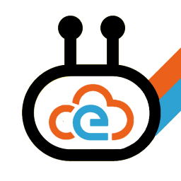

## Introduction 
{.float-right}

**CloudEvents** are a specification which describe event data in a common way. **Event Framework** is a platform for creating, receiving, sending and handling CloudEvents in .NET.

The core functionalities of Event Framework are:

* Create CloudEvents from .NET objects
* Receive and send CloudEvents
* Handle CloudEvents
* Create CloudEvent sources

## Supported Platforms

Event Framework is available for .NET Core 3.1. Some parts of it are available as .NET Standard 2.0 libraries.

## License

Event Framework is available as an open source, MIT-licensed project. 

## Support

Commercial support for Event Framework is available.